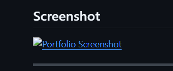

# Jobayer Hosen — Personal Portfolio

A modern, responsive personal portfolio website built with **Next.js 15**, **Tailwind CSS v4**, **DaisyUI v5**, and **Framer Motion**. Features dark/light mode, smooth animations, and a functional contact form powered by EmailJS.

🌐 **Live Site:** [https://jobayerhosen-portfolio.vercel.app/](https://jobayerhosen-portfolio.vercel.app/)

---

## Screenshot



---

## About Me

I'm Jobayer Hosen, a passionate Frontend & Full-Stack Web Developer from Bhola, Bangladesh. I specialize in building beautiful, performant, and user-friendly web applications using modern technologies.

- 🎓 Studying Web Development at **Bhola Polytechnic Institute**, Lalmohon, Bhola
- 🏆 Completed **MERN Stack Web Development** at **BD Calling Academy**
- 📚 Completed **Frontend & Full-Stack Development** program at **Programming Hero**
- 💼 Running **REEZ** — a men's clothing brand

---

## Tech Stack

**Frontend**
- React 19
- Next.js 15 (App Router)
- Tailwind CSS v4
- DaisyUI v5
- Framer Motion

**Backend & Database**
- Node.js
- Express.js
- MongoDB
- Firebase

**Tools & Workflow**
- Git & GitHub
- Vercel (Deployment)
- EmailJS (Contact Form)
- VS Code

---

## Features

- ⚡ Built with Next.js 15 App Router & Turbopack
- 🌙 Dark / Light mode toggle (persisted via localStorage)
- 🎞️ Smooth page & scroll animations with Framer Motion
- 📬 Functional contact form via EmailJS
- 📱 Fully responsive — mobile, tablet, desktop
- 🖼️ Optimized images with Next.js `<Image />`
- 🔗 Separate pages — Home, Projects, About, Contact

---

## Pages

| Page | Description |
|------|-------------|
| `/` | Hero section, skills, and featured projects |
| `/projects` | Full project showcase grid |
| `/about` | Background, education, and personal info |
| `/contact` | EmailJS-powered contact form |

---

## Dependencies

- `next` — ^15.x
- `react` / `react-dom` — ^19.x
- `tailwindcss` — ^4.x
- `daisyui` — ^5.x
- `framer-motion`
- `@emailjs/browser`

---

## Getting Started

### Prerequisites
- Node.js 18+
- npm or yarn

### Installation

```bash
# 1. Clone the repository
git clone https://github.com/JOBAYER07-dev/portfolio.git

# 2. Navigate into the project
cd portfolio

# 3. Install dependencies
npm install

# 4. Run the development server
npm run dev
```

Open [http://localhost:3000](http://localhost:3000) in your browser.

---

## EmailJS Setup

To enable the contact form:

1. Create a free account at [emailjs.com](https://emailjs.com)
2. Connect your email service (Gmail recommended)
3. Create an email template with these variables: `from_name`, `reply_to`, `subject`, `message`
4. Open `app/contact/page.jsx` and update the following constants:

```js
const EMAILJS_SERVICE_ID  = "your_service_id";
const EMAILJS_TEMPLATE_ID = "your_template_id";
const EMAILJS_PUBLIC_KEY  = "your_public_key";
```

---

## Project Structure
